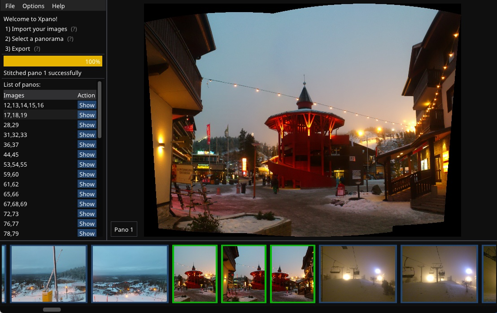

[](https://github.com/krupkat/xpano/actions/workflows/test.yml)
[](https://github.com/krupkat/xpano/actions/workflows/clang-format-check.yml)
[](https://github.com/krupkat/xpano/actions/workflows/clang-tidy-check.yml)

# xpano

Xpano is a tool for panorama stitching with focus on simplicity and ease of use, major features include:

- Auto detection of groups of images that can be stitched into panoramas
- Preview + zoom + pan of the computed panoramas
- Crop mode, boundary auto fill, selectable projection types
- Export of full resolution panoramas including exif metadata


## Built with

The app uses the excellent [OpenCV](https://opencv.org/) library for image manipulation and its [stitching](https://docs.opencv.org/4.x/d1/d46/group__stitching.html) module for computing the panoramas.

Other dependencies include [imgui](https://github.com/ocornut/imgui), [SDL](https://github.com/libsdl-org/SDL), [spdlog](https://github.com/gabime/spdlog/), [Catch2](https://github.com/catchorg/Catch2), [nativefiledialog-extended](https://github.com/btzy/nativefiledialog-extended), [alpaca](https://github.com/p-ranav/alpaca), [thread-pool](https://github.com/bshoshany/thread-pool), [expected](https://github.com/TartanLlama/expected), [Exiv2](https://github.com/Exiv2/exiv2), [multiblend](https://horman.net/multiblend/), [SIMDe](https://github.com/simd-everywhere/simde) and the [Google Noto](https://fonts.google.com/noto) fonts.

## Demo

Check out the demo on [YouTube](https://youtu.be/MyiTC3i1hK0). This is how the app looks after importing a directory of 200 images.



## Installation

Install directly from Flathub or the Microsoft Store:

<a href='https://flathub.org/apps/details/cz.krupkat.Xpano'></a>&nbsp;&nbsp;<a href='https://apps.microsoft.com/store/detail/9PGQ5X33L0SC?launch=true&mode=full'></a>

Additionally you can download Windows executables from [GitHub](https://github.com/krupkat/xpano/releases) and Ubuntu packages from a [Launchpad PPA](https://launchpad.net/~krupkat/+archive/ubuntu/code).

## Command line

Xpano has basic CLI support, you can either run it fully automatic in the command line, or launch to gui with the `--gui` flag.

```
Xpano [<input files>] [--output=<path>] [--gui] [--help] [--version]
```

## Development

The project can be built by running a single script from the `misc/build` directory. You will need at least CMake 3.21, git and a compiler with C++20 support.

### MacOS

Library prerequisites: SDL2, spdlog, catch2

Install with brew: `brew install sdl2 spdlog catch2`

Install with macports: `sudo port install libsdl2 spdlog catch2` (for details: [#96](https://github.com/krupkat/xpano/pull/96#issuecomment-1575589249))

Run the install script from the root of the repository:

```
./misc/build/build-macos-12.sh
```

See https://github.com/krupkat/xpano/pull/99 for build instructions on the Apple silicon.

### Ubuntu 22.04

Library prerequisites:

```
sudo apt install libgtk-3-dev libopencv-dev libsdl2-dev libspdlog-dev
```

Run the install script from the root of the repository:

```
./misc/build/build-ubuntu-22.sh
```

### Ubuntu 20.04

Build works with `g++-10` from the system repository. You will have to install a more recent version of CMake, e.g. from [Kitware](https://apt.kitware.com/).

Library prerequisites:

```
sudo apt install libgtk-3-dev
```

Run the install script from the root of the repository:

```
./misc/build/build-ubuntu-20.sh
```

### Windows

Open the "Developer PowerShell for VS 2022" profile in Windows Terminal and run the install script from the root of the repository:

```
./misc/build/build-windows-latest.ps1
```

## Contributions

Contributions are more than welcome, there is a couple of ideas for enhancements in [open issues](https://github.com/krupkat/xpano/issues) which you could take on - if you start working on one of them, please add a comment there. 

Please check the [contribution guidelines](https://github.com/krupkat/xpano/blob/main/CONTRIBUTING.md) for further details regarding formatting and coding style.

## License

Distributed under the *GPL-3.0-or-later* license. See the full [license text](https://github.com/krupkat/xpano/blob/main/LICENSE) for more information.

## Contact

Tomas Krupka - [krupkat.cz](https://krupkat.cz)
